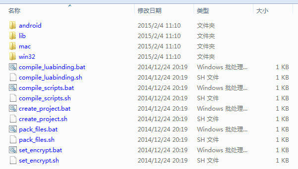

# Cocos2d-Lua(Quick-Cocos2d-x)的文件结构分析

> 我们前面写过一篇Quick-Cocos2d-x 2.x的文件结构的文章，链接[点这里](http://cn.cocos2d-x.org/tutorial/show?id=1138)。Quick-Cocos2d-x 3.3的文件系统的改动比较大，我们接下来详细分析下现在的文件系统。

首先，我们进入Quick-Cocos2d-x 3.x的文件夹下后可以看到下面的目录结构：

我们挨着一个个的来讲解：

* `build`: Cocos2d-x 3.3中库的工程；
* `cocos`: Cocos2d-x 3.3的引擎C++代码；
* `docs`: Quick-Cocos2d-x 的文档；
* `extensions`: Cocos2d-x 3.3的extensions目录，主要是引擎的扩展；
* `external`: Cocos2d-x 3.3的第三方库；
* `licenses`: 引擎和使用的第三方库使用的license；
* `quick`: Quick-Cocos2d-x的引擎代码；
* `tools`: Cocos2d-x 3.3的项目生成等工具；
* `player3.bat`: 启动Quick模拟器的脚本；
* `setup_mac.sh`: Mac下设置Quick-Cocos2d-x 3.3的环境变量的脚本文件；
* `setup_win.bat`: Windows下设置Quick-Cocos2d-x 3.3的环境变量的脚本文件；
* `unins000.dat,unins000.bat`: Windows下卸载引擎的执行程序。

上面的这些内容在Mac上和在Windows上基本上都是一样的。下面我们来重点介绍下quick文件夹下的文件。Quick-Cocos2d-x 3.3为了支持插件式花费了很大的精力来调整引擎的结构和代码兼容性。

我们打开quick文件夹，可以看到如下的文件结构：

* `bin`: Quick-Cocos2d-x可执行的一些脚本。

    

	- `android`: android下的包和quick的签名；
	- `lib`: php脚本文件；
	- `mac`: Mac下的一些可执行程序，主要是lua、luajit、tolua++等；
	- `win32`: Windows下的一些可执行程序，主要是lua、luajit、php等；
	- `compile_luabinding.xxx`: Mac和Windows下从c++到lua的luabinding脚本；
	- `compile_scripts.xxx`: 用来将lua脚本成二进制的，在我们发布版本时，对包进行编译转成二进制防止反编译；
	- `create_project.xxx`: Quick-Cocos2d-x中用来创建工程的脚本；
	- `pack_files.xxx`: Quick-Cocos2d-x中用来打包资源文件；
	- `set_encrypt.xxx`: Quick-Cocos2d-x中用来加密的脚本；

* `cocos`: Cocos2d-Lua导出的接口。
* `framework`: Quick-Cocos2d-x的核心，在Cocos2d-x基础上封装自己的的一套框架。极大的提高了开发效率。

	

	- `cc`: cc扩展在Cocos2d-x C++ API和quick基本模块的基础上，提供了符合脚本风格的事件接口、组件架构等扩展。

		+ `init.lua`:初始化cc扩展
        + `GameObject.lua`:quick现在使用的一套类似Unity3D的GameObject的框架
        + `Registry.lua`:quick中GameObject的注册器
        + `EventProxy.lua`:quick的事件管理器
        + `Component`:组件基类，所有组件都要派生自它
        + `mvc`:quick中的mvc结构，要使用mvc结构的话只需要集成AppBase和ModelBase
        + `net`:网络接口封装，使用Socket连接
        + `ui`:quick封装的Cocos2d-x控件，包含:UIGroup、UIImage，UIPushButton，UICheckBoxButton，UICheckBoxButtonGroup，UILabel，UISlider，UIBoxLayout
        + `utils`:quick中其他的封装的功能

	- `cocos2dx`: Quick-Cocos2d-x对原生Lua中一些控件的加强；
	- `deprecated`: 废弃的接口；
	- `platform`: Quick-Cocos2d-x针对不同平台的接口；
    - `cocos2dx`: quick对Cocos2d-x中的扩展
    - `platform`: 平台移植代码
    - `audio.lua`: 音乐、音效管理
    - `cocos2dx.lua`: 导入Cocos2d-x的库
    - `crypto.lua`: 加解密、数据编码库
    - `debug.lua`: 提供调试接口
    - `deprecated.lua`: 定义所有已经废弃的 API
    - `device.lua`: 提供设备相关属性的查询，以及设备功能的访问
    - `display.lua`: 与显示图像、场景有关的功能
    - `filter.lua`: 滤镜功能
    - `functions.lua`: 提供一组常用函数，以及对 Lua 标准库的扩展
    - `init.lua`: quick framework的初始化
    - `json.lua`: json的编码与解码
    - `luaj.lua`: Lua与Java之间的交互接口
    - `luaoc.lua`: Lua与Objective-c之间的交互接口
    - `network.lua`: 网络接口封装，检查wifi和3G网络情况等
    - `schduler.lua`: 全局计时器、计划任务，该模块在框架初始化时不会自动载入
    - `shortcode.lua`: 一些经常使用的短小的代码，比如设置旋转角度之类
    - `transition.lua`: 为动作和对象添加效果
    - `ui.lua`: 创建和管理用户界面
	- `anysdkConst.lua`: AnySDK中一些常量的定义

* `lib/quick-src`: Quick-Cocos2d-x原来对引擎的修改，现在提取出来放到这个文件夹下。
* `player`: Quick-Cocos2d-x的模拟器代码和可执行文件。
* `samples`: Quick-Cocos2d-x的例子工程。
* `templates`: Quick-Cocos2d-x新建工程的模板。
* `welcome`: Quick-Cocos2d-x模拟器启动后显示的欢迎界面。
